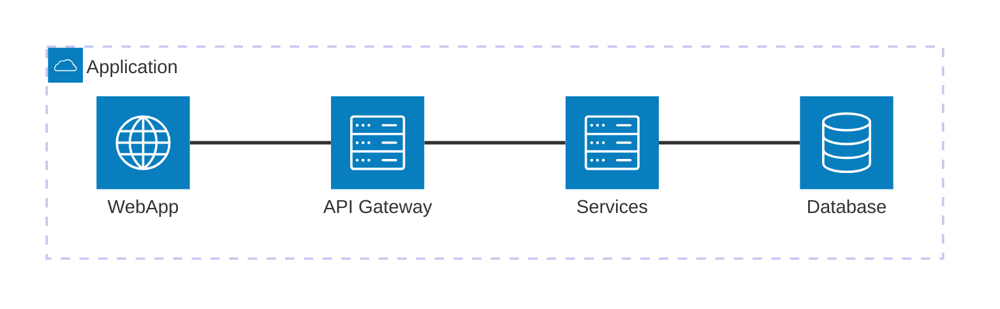
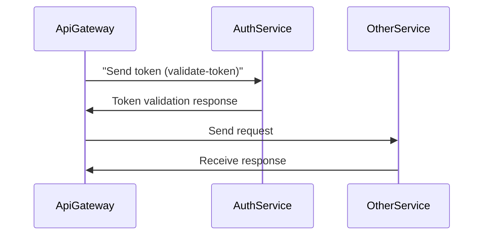
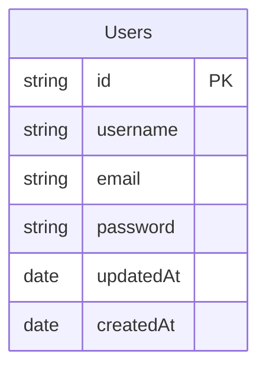
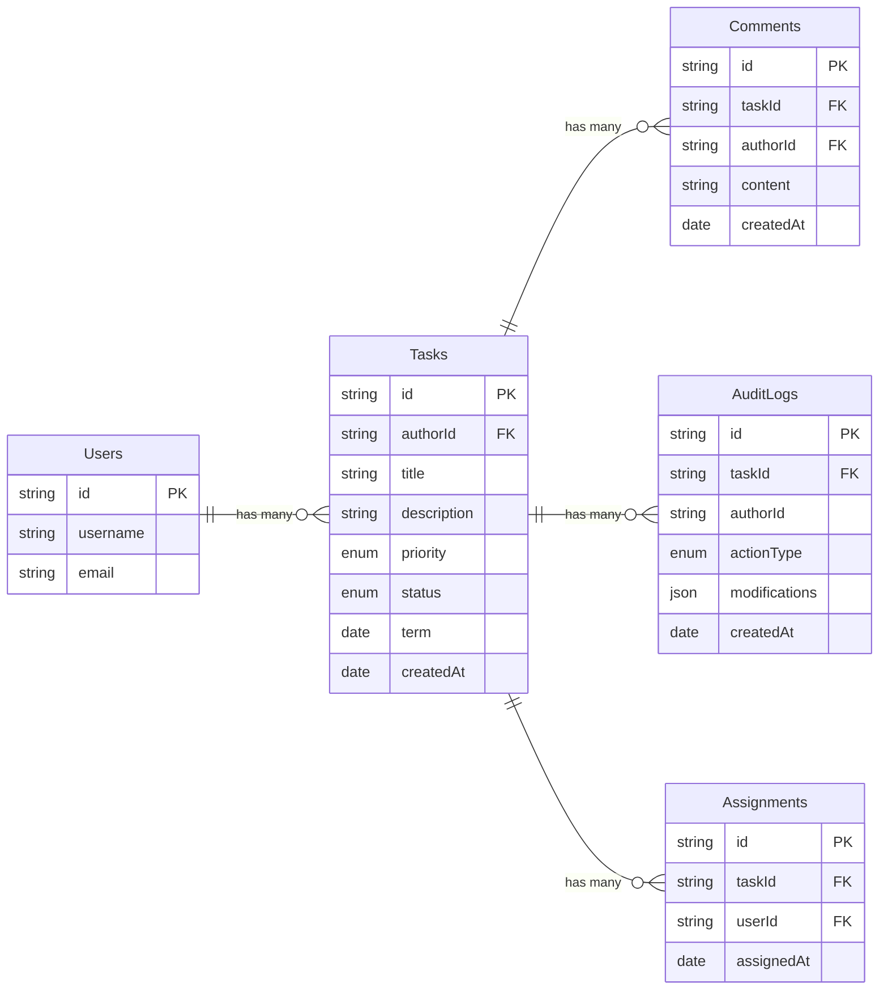
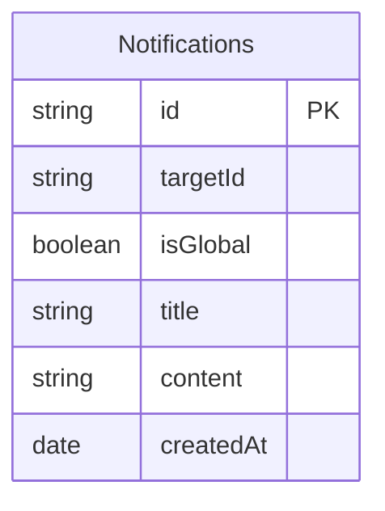

# Desafio Full-stack Júnior

Construir um Sistema de Gestão de Tarefas Colaborativo com autenticação simples, CRUD de tarefas, comentários, atribuição e notificações. O sistema deve rodar em monorepo e expor uma UI limpa, responsiva e usável. O back‑end deve ser composto por microsserviços Nest que se comunicam via RabbitMQ; o acesso HTTP externo passa por um API Gateway (Nest HTTP).

## Conteúdo

- [Pacotes](#01-pacotes)
- [Estruturas](#02-estruturas)
- [Decisões](#03-decisões)
- [Diagramas](#04-diagramas)
- [Tempo gasto](#05-tempo-gasto)
- [Possíveis melhorias](#06-possíveis-melhorias)
- [Rodar projeto](#07-rodar-projeto)

## 01 Pacotes

A utilização de pacotes centralizados é um dos pontos fortes de se utilizar um monorepo, fazendo assim você conseguir escrever um código mais objetivo, sem tanta repetição, e mais confiável, utilizando os pacotes para manter a coerência na comunicação entre microsserviços. Ou seja, seguindo assim princípios como SOLID e DRY, algo que valorizo muito. Com isso em mente, veja abaixo os pacotes criados nesse projeto.

#### Constants

Responsável por armazenar as principais constantes do projeto, sendo elas: nome de serviços, nome de mensagens (message-pattern) e nome de eventos (event-pattern).

#### DTOs

Responsável por alinhar todas as transferências de dados entre microsserviços, contendo classes para eventos, mensagens e DTOs para as requisições HTTP.

#### Shared

Responsável por compartilhar classes que são utilizadas em mais de uma aplicação, como: Entity, Pagination e tipos.

#### Errors

Responsável por todas as classes de erros utilizados nas aplicações.

#### TSConfig & Eslint

Pacotes que compartilham arquivos de configuração.

## 02 Estruturas

O primeiro passo que tomei foi pensar em como eu estruturaria o projeto, tendo em mente que ele tem que ser um monorepo (Turborepo) e com uma arquitetura de microsserviços. Pensando em todos os requisitos, decidi começar pelo serviço de autenticação, logo em seguida começar o gateway da API, serviços de tarefas, serviço de notificações e, por fim, o aplicativo web.

#### Serviço de autenticação

Nesse serviço, decidi seguir uma estrutura de arquivos mais simples, contendo:

- Domain (entities, repositories, use-cases, services, providers)
  - Responsável por todo o core da nossa aplicação, contendo toda a regra de negócio. Utiliza abstrações para integrar serviços e provedores.
- Infra (NestJS, RabbitMQ)
  - Responsável por integrar o nosso domínio com o mundo externo, nesse caso utilizando RabbitMQ & NestJS. Também responsável por dar vida aos serviços/provedores, sendo eles: JWT, BCrypt e o serviço de notificações.

#### Serviço de tarefas

Nessa aplicação, como ela é um pouco mais complexa, acabei optando por uma estrutura mais robusta, sendo dividida em "domínios" diferentes (tasks, audit-logs, comments e assignments).

- Tasks, Comments, Assignment e AuditLogs
  - app
    - Responsável pela lógica de negócio, contendo casos de uso e DTOs.
  - domain
    - Responsável por entidades e repositórios.
  - infra
    - Responsável por integrar o domínio e a lógica de negócio com microsserviços e banco de dados.

**Benefícios**: seguir uma estrutura assim a longo prazo é algo muito vantajoso, trazendo segurança, flexibilidade e escalabilidade.
**Trade-off**: ela pode ser um pouco mais trabalhosa de se implementar.

#### Serviços de notificações

Essa aplicação acaba sendo mais simples se comparada com as outras, portanto decidi seguir uma estrutura mais simples sem a utilização de abstrações, um bom e velho projeto Nest.

- Events
  - Lida com classes de eventos locais.
- Auth
  - Contém um serviço de autenticação responsável por se comunicar com o microsserviço de autenticação para fazer a validação do usuário ao se conectar com WebSocket.
- Notifications
  - Entities:
    - Entidades do TypeORM;
  - Controller, service e module (NestJS)
    - Responsáveis por receber os eventos pelo RabbitMQ, criar notificações, salvá-las no banco de dados e emitir eventos locais para o WebSocket gateway.
- WebSocket
  - Gateway
    - Responsável pelas conexões WebSocket, realizando autenticação, recebendo eventos locais e enviando novas mensagens.

#### Api Gateway

Nessa aplicação, também utilizei uma estrutura bem básica, apenas separando pastas para cada serviço, integrando-os e lidando com autenticação.

#### Aplicativo Web

No aplicativo web, acabei utilizando uma estrutura bem básica, comumente vista em projetos React. Alguns diferenciais foram: a organização da API e a utilização do Tanstack Router code-based.

## 03 Decisões

Algumas decisões que tomei mediante o projeto, o porquê delas e trade-offs.

- A utilização de boas práticas
  - Com toda a experiência que tenho em desenvolvimento fullstack, como você estrutura um projeto, desde arquivos, abstrações e integrações, quando falamos de manutenção e crescimento, faz total diferença no futuro do projeto. Com o tempo, acabei aprendendo que utilizar certas metodologias/boas práticas pode te trazer uma certa complexidade a mais na hora do desenvolvimento, mas, no final das contas, acaba sendo algo imprescindível.

- A não utilização da lib **Passport**
  - Sendo uma das exigências do projeto, pensei muito sobre isso e, no final, optei por não utilizá-la. Com a utilização de um serviço de autenticação centralizado, não faria sentido ter que lidar com a encriptação/decriptação dos tokens JWT no API Gateway, onde ela se sairia melhor. Ir para o serviço de autenticação também não faz sentido, já que o principal ponto em utilizar uma biblioteca dessas seria a facilidade de integração e a integração com outros serviços de OAuth. Integrando-a a um microsserviço, perderíamos boa parte da facilidade que ela traz, como o parse de headers e cookies, e, com serviços de terceiros, precisaríamos de uma camada a mais para interligá-la.
- A utilização de **DTOs** com class-validator.
  - Optei por utilizar DTOs em todas as comunicações entre os serviços visando garantir à confiabilidade dos dados.
  - Também utilizei DTOs em todos os parâmetros/query/body recebidos pelo API Gateway.
  - **Trade-offs**: É uma camada a mais a cada requisição, oque acaba "piorando" o desempenho mesmo que seja um custo irrisório.

- Duplicidade de dados (**Tasks-services**)
  - Indo para o serviço de tarefas, uma das suas responsabilidades é a listagem de tarefas, porém, ao fazer o frontend, percebi que seria muito importante possuir alguns dados que não são responsabilidade do serviço de tarefas, sendo eles as informações de usuários, sendo o criador da tarefa ou um usuário associado. Para isso eu poderia fazer uma requisição para o serviço de autenticação para buscar os usuários, porém isso não seria nada escalável.
  - Decidi optar por uma prática muito comum em arquitetura de microsserviços, a duplicidade de dados, ou seja, no serviço de tarefas, eu manteria uma cópia de todos os usuários criados. Quando um usuário fosse criado, o serviço de autenticação mandaria uma mensagem para o RabbitMQ; depois, o serviço de tarefas consumiria isso e salvaria o usuário no seu banco de dados.
  - Assim, tendo todos os dados necessários para enviar as informações dos usuários associados a uma tarefa, sem precisar fazer 1.000.000 de requisições desnecessárias.
  - **Trade-offs**: A duplicidade de dados é algo que acaba ocupando mais espaço em banco de dados e mais tráfego na rede, porém é algo irrisório se comparado com grande parte das alternativas.
    > No caso desse projeto, como utilizamos o mesmo banco de dados, poderia só fazer uma nova query, porém, pensando em um caso real de microsserviços, acredito que essa seria a estratégia ideal.
- Controle de tokens.
  - Decidi realizar todo o gerenciamento de tokens no serviço de autenticação utilizando apenas JWT, algo que acredito ser o ideal para uma aplicação mais "simples" como essa.
  - **Trade-offs**: Quando comparado com uma implementação mais complexa utilizando entidades para manter o controle dos tokens, você acaba perdendo informações/controles como: registro de localizações/data/ip, controle de acesso (revogar acesso), entre algumas outras coisas.

- Aplicação web
  - Listagem de tarefas.
    - Nesse projeto, uma das exigências era a listagem de tarefas possuir filtros e busca. Optei por não utilizar tabelas nessa página, trazendo um design mais "único".
    - Trade-offs: A implementação dos filtros e busca foi feita na mão, sem utilização de libs como react-table, o que resultou em um pouco mais de trabalho.
  - Parâmetros de busca.
    - Algo que valorizo bastante em páginas que contêm informações de paginação/filtros é a persistência desses estados utilizando search params.
    - Trade-offs: só vantagens, rs.

Dentre todas as decisões, acredito que essas tenham sido as principais. Algumas, como a utilização de pacotes para seguir princípios como o DRY, já foram apresentadas acima.

> Outra decisãozinha, só é possível você mesmo se associar a uma tarefa. (seja feliz e tenha autonomia rs)

## 04 Diagramas

#### Arquitetura



#### Autenticação

Como a autenticação deve ser integrada utilizando o ApiGateway e outros serviços:



#### Serviço de autenticação

Veja as entidades do serviço de tarefas:



#### Serviço de tarefas

Veja as entidades do serviço de tarefas:



#### Serviço de notificações

Veja as entidades do serviço de tarefas:



## 05 Tempo gasto

Veja abaixo o tempo gasto seguindo a linha do tempo do projeto.

#### Serviço de autenticação

- Criação do domínio
  - Duração: **<1 hora**
- Integração do domínio com infra - Duração: **~1 hora**
  > Feito no primeiro dia.

#### Serviço de tarefas

- Criação dos domínios
  - Duração: **>1 hora** cada
- Integração do domínio - Duração: **~1 hora** cada
  > Feito no segundo & terceiro dia, parte de associação feita no quito dia.

#### Serviço de notificações

- Duração: **~1 hora + 1/2**
  > Feita no ultimo dia.

#### API Gateway

- Duração: **ao todo pouco mais de 2 horas e meia**
  > Feita conforme os serviços foram ficando prontos.

#### Aplicação Web

- Duração: **7 horas +**
  > Feita em uns 2 dias, foi de longe a aplicação que mais demorou a ser feita, como dei preferência em criar uma interface "bonita" e fluida, acabou demorando um tiquinho a mais de tempo.

#### Refatoração

- Duração: **4 horas +**
  > Depois de algumas mudanças, refatorei algumas partes do projeto como um todo, visando melhorias na experiência do desenvolvimento e algumas no front-end, visando performance.

#### Planejamento

- Duração: **3 horas +**
  > Todo o planejamento inicial, criando estrutura das entidades, pensando em como integrar todos os serviços, etc.

## 06 Possíveis melhorias

Revisando toda a minha trajetória criando esse sistema, notei algumas melhorias que ficam como objetivo para projetos futuros:

- Melhorar planejamento.
  - Planejando de maneira mais eficiente e completa.
- Melhorar padrão de commits.
  - Acabei percebendo a falta de clareza em meus commits; como é algo essencial em projetos de equipe, será um baita aperfeiçoamento.

## 07 Rodar projeto

#### Instalação

1. Primeiro passo, clone esse repositório.
2. Segundo passo, acesse o diretório principal do projeto e instale as dependências.

```sh
npm install
```

#### Iniciar em modo de desenvolvimento

1. Primeiro passo, configure todas as **.env** seguindo o arquivo **.env.example** de exemplo.
2. Segundo passo, crie o banco de dados e o serviço RabbitMQ com docker utilizando o seguinte comando:

```sh
docker compose -f docker-compose.dev.yml --env-file .env.dev up
```

4. Terceiro passo, rode as migrações acessando cada pacote e utilizando o seguinte comando:

```sh
npm run run:migrations
```

5. Quarto passo, acesse o diretório principal do projeto e execute o seguinte comando:

```sh
npm run dev
```

#### Iniciar projeto utilizando o docker

1. Primeiro passo, instale as dependências.
2. Segundo passo, execute o seguinte comando:

```sh
docker compose -f docker-compose.yml --env-file .env.example up
```

> Obs: acabei tendo que utilizar o modo de rede dos containers como **HOST** por conta de um bug no WSL.

<!--# Teste técnico JG

Construir um Sistema de Gestão de Tarefas Colaborativo com autenticação simples, CRUD de tarefas, comentários, atribuição e notificações. O sistema deve rodar em monorepo e expor uma UI limpa, responsiva e usável. O back‑end deve ser composto por microsserviços Nest que se comunicam via RabbitMQ; o acesso HTTP externo passa por um API Gateway (Nest HTTP).

## Apps

- [Api gateway](#apigateway)
- [Auth service](#authservice)
- [Tasks service](#authservice)

## Pacotes

- [@microservices](#microservices)

## Progresso

Acompanhe como foi o progresso da criação de cada serviço.

- [ ] WebApp
  - [x] Configurar projeto
  - [x] Criar rotas publicas & privadas (com autenticação)
    - Duração: **~1 hora**
  - [x] Criar páginas de login/cadastro
    - Duração: **>1 hora**
  - [x] Criar página de tarefas
    - Duração: **~1 hora + 1/2**
  - [ ] Criar página de detalhes de uma tarefas

- [x] AuthService
  - [x] Criar o domínio do serviço
    - Duração: **~2 horas**
    - [x] Setup inicial (nestjs & jest)
    - [x] Criar entidades
    - [x] Criar repositórios
    - [x] Criar os casos de uso
      - [x] Cadastro
      - [x] Login
      - [x] Gerar tokens
      - [x] Revalidar token
  - [x] Integrar o domínio com a infraestrutura (NestJS Microservices, JWT, Bcrypt, DB typeORM)
    - Duração: **~1 hora + 1/2**
      - _+ uns 20 minutos configurando tudo do TypeORM 🥲_
    - [x] Criar repositórios/entidades utilizando TypeORM e Postgres
    - [x] Criar providers (Bcrypt, JWT)
    - [x] Criar controller
- [ ] TaskService
  - [x] Criar o domínio das tasks
    - Duração: **~1 hora**
    - [x] Criar entidades
    - [x] Criar repositórios
    - [x] Criar casos de uso
      - [x] Buscar tarefa
      - [x] Buscar múltiplas tarefas com paginação
      - [x] Criar tarefa
      - [x] Atualizar tarefa
      - [x] Deletar tarefa
  - [x] Integrar o domínio das tarefas com a infraestrutura
    - Duração: **~1 hora**
    - [x] Criar DTOs compartilhados (@shared)
    - [x] Criar repositórios/entidades utilizando TypeORM e Postgres
    - [x] Criar controller
  - [x] Criar domínio dos comentários
    - Duração: **<1 hora**
    - [x] Criar entidades
    - [x] Criar repositórios
    - [x] Criar casos de uso
      - [x] Criar comentário
      - [x] Listar comentários de uma tarefa especifica com paginação
  - [x] Integrar o domínio dos comentários com a infraestrutura
    - Duração: **~1 hora**
    - [x] Criar DTOs compartilhados (@shared)
    - [x] Criar repositórios/entidades utilizando TypeORM e Postgres
    - [x] Criar controller
  - [x] Criar domínio do histórico de atualizações + integração com casos de uso das tarefas
    - Duração: **<1 hora**
    - [x] Criar entidades
    - [x] Criar repositórios
    - [x] Criar casos de uso
      - [x] Criar registro de alteração
      - [ ] Listar registro de alterações com paginação

- [ ] ApiGateway
  - [x] Setup inicial
  - [x] Autenticação
    - Duração: **~30 minutos**
    - [x] AuthModule (controller & service & dto)
      - [x] Integração com [auth-service](#authservice)
    - [x] AuthGuards (controle de autenticação)
  - [x] Tarefas
    - Duração: **<30 minutos**
    - [x] Criar serviço para realizar a integração com [task-service](#taskservice)
    - [x] Criar dtos
    - [x] Criar rotas
  - [x] Comentários
    - Duração: **<20 minutos**
    - [x] Criar serviço para realizar a integração com [task-service/comments](#taskservice)
    - [x] Criar dtos
    - [x] Criar rotas

## ApiGateway

Serviço responsável por realizar o acesso HTTP aos demais serviços.

Requisitos:

- [ ] Autenticação com Guards
- [ ] Integrar todos os serviços com **RabbitMQ**
- [ ] DTOs (`class-validator` e `class-transformer`)
- [ ] Rate limit (10 req/seg)
- [ ] Documentação com Swagger
- [ ] Gateway WebSocket para notificações em tempo real
- [ ] Health checks
- [ ] Logging com Pino

## AuthService

Será o microsserviço responsável por lidar com toda a parte de autenticação dos usuários sendo elas: cadastro, login, validação e refresh de tokens.

#### Arquitetura

Como a autenticação deve ser integrada utilizando o ApiGateway e outros serviços:


#### Entidades


#### Requisitos funcionais:

- [x] Cadastro do usuário (email, username, password)
  - [x] Hash de senha utilizando BCrypt
- [x] Login do usuário (email, password)
- [x] Geração de tokens JWT (accessToken, refreshToken)
- [x] Revalidar token JWT (refreshToken)
- [x] Validar token JWT (accessToken)
- [ ] Reset de senha (bônus)

#### Implementações & Decisões

- Nesse serviço, decidi implementar DDD (Domain-Driven Design), algo que a longo prazo, é extremamente valioso quando pensamos em flexibilidade, escalabilidade e em manutenções futuras.
  - Trade-offs: A implementação em si pode ser um pouco mais trabalhosa.
- Realizar o gerenciamento de tokens apenas pelo JWT.
  - Benefícios: Uma implementação bem mais simples.
  - Trade-offs: Quando comparado com uma implementação mais complexa utilizando entidades para manter o controle dos tokens, você acaba perdendo informações/controles como: registro de localizações/data/ip, controle de acesso (revogar token), entre algumas outras coisas.
  - Motivação: Decidi ir pelo caminho mais simples até então; como é uma aplicação um tanto quanto "simples", não vi a necessidade de realizar essa implementação mais complexa.
  - _Caso sobre tempo acredito que seja um baita de um bônus._

## TaskService

Será o serviço responsável por lidar com toda a parte de tarefas, sendo elas: CRUD completo, comentários, audit log.

#### Entidades


> Prioridade: `LOW`, `MEDIUM`, `HIGH`, `URGENT`
> Status: `TODO`, `IN_PROGRESS`, `REVIEW`, `DONE`

#### Requisitos funcionais:

- [x] Tarefas
  - [x] Busca por múltiplas tarefas com paginação
  - [x] Busca por uma tarefa especifica
  - [x] Criação de novas tarefas
  - [x] Atualizar tarefa
  - [x] Excluir tarefa
- [ ] Histórico de alterações
  - [ ] Ao alterar uma tarefa deverá ser necessário o registro dessa alteração
- [ ] Comentários
  - [ ] Criar comentários associas a uma tarefa especifica
  - [ ] Listar comentários de uma tarefa em especifico

#### Implementações & Decisões

- ...

A fazer:

- [ ] Refazer notificações
- [ ] Responsividade
- [ ] Diferenciais: Health checks, Logs (pinno)

=-=-=-=-=
# Desafio Full-stack Júnior
Construir um Sistema de Gestão de Tarefas Colaborativo com autenticação simples, CRUD de tarefas, comentários, atribuição e notificações. O sistema deve rodar em monorepo e expor uma UI limpa, responsiva e usável. O back‑end deve ser composto por microsserviços Nest que se comunicam via RabbitMQ; o acesso HTTP externo passa por um API Gateway (Nest HTTP).

# Trajetória

## 01 Pacotes
A utilização de pacotes centralizados é um dos pontos fortes de se utilizar um monorepo, fazendo assim você conseguir escrever um código mais objetivo, sem tanta repetição, e mais confiável, utilizando os pacotes para manter a coerência na comunicação entre microserviços. Ou seja, seguindo assim princípios como SOLID e DRY, algo que valorizo muito. Com isso em mente, veja abaixo os pacotes criados nesse projeto.

#### Constants
Responsável por armazenar as principais constantes do projeto, sendo elas: nome de serviços, nome de mensagens (message-pattern) e nome de eventos (event-pattern).

#### DTOs
Responsável por alinhar todas as transferências de dados entre microserviços, contendo classes para eventos, mensagens e DTOs para as requisições HTTP.

#### Shared
Responsável por compartilhar classes que são utilizadas em mais de uma aplicação, como: Entity, Pagination e tipos.

#### Errors
Responsável por todas as classes de erros utilizados nas aplicações.

#### TSConfig & Eslint
Pacotes que compartilham arquivos de configuração.

## 02 Estruturas

O primeiro passo que tomei foi pensar em como eu estruturaria o projeto, tendo em mente que ele tem que ser um monorepo (Turborepo) e com uma arquitetura de microserviços. Pensando em todos os requisitos, decidi começar pelo serviço de autenticação, logo em seguida começar o gateway da API, serviços de tarefas, serviço de notificações e, por fim, o aplicativo web.

#### Serviço de autenticação
Nesse serviço, decidi seguir uma estrutura de arquivos mais simples, contendo:
-   Domain (entities, repositories, use-cases, services, providers)
	 -   Responsável por todo o core da nossa aplicação, contendo toda a regra de negócio. Utiliza abstrações para integrar serviços e provedores.
-   Infra (NestJS, RabbitMQ)
	 -   Responsável por integrar o nosso domínio com o mundo externo, nesse caso utilizando RabbitMQ & NestJS. Também responsável por dar vida aos serviços/provedores, sendo eles: JWT, BCrypt e o serviço de notificações.

#### Serviço de tarefas
Nessa aplicação, como ela é um pouco mais complexa, acabei optando por uma estrutura mais robusta, sendo dividida em "domínios" diferentes (tasks, audit-logs, comments e assignments).

-   Tasks, Comments, Assignment e AuditLogs
	-   app
		-  Responsável pela lógica de negócio, contendo casos de uso e DTOs.
	-   domain
		- Responsável por entidades e repositórios.
	 -   infra
		 - Responsável por integrar o domínio e a lógica de negócio com microserviços e banco de dados.

**Benefícios**: seguir uma estrutura assim a longo prazo é algo muito vantajoso, trazendo segurança, flexibilidade e escalabilidade.
**Trade-off**: ela pode ser um pouco mais trabalhosa de se implementar.

#### Serviços de notificações
Essa aplicação acaba sendo mais simples se comparada com as outras, portanto decidi seguir uma estrutura mais simples sem a utilização de abstrações, um bom e velho projeto Nest.

-   Events
	-   Lida com classes de eventos locais.
-   Auth
	-   Contém um serviço de autenticação responsável por se comunicar com o serviço de autenticação para fazer a validação do usuário ao se conectar com WebSocket.
-   Notifications
	-   Entidades:
		-   Entidades do TypeORM;
	-   Controller, service e module (NestJS)
		-   Responsáveis por receber os eventos pelo RabbitMQ, criar notificações, salvá-las no banco de dados e emitir eventos locais para o WebSocket gateway.
-   WebSocket
	-   Gateway
		-   Responsável pelas conexões WebSocket, realizando autenticação, recebendo eventos locais e enviando novas mensagens.

#### Api Gateway
Nessa aplicação, também utilizei uma estrutura bem básica, apenas separando pastas para cada serviço, integrando-os e lidando com autenticação.

#### Aplicativo Web
No aplicativo web, acabei utilizando uma estrutura bem básica, comumente vista em projetos React. Alguns diferenciais foram: a organização da API e a utilização do Tanstack Router code-based.

## 03 Decisões
Algumas decisões que tomei mediante o projeto, o porquê delas e trade-offs.

- A utilização de boas práticas
	- Com toda a experiência que eu tenho em desenvolvimento fullstack, como você estrutura um projeto, desde arquivos, abstrações e integrações, quando falamos de manutenção e crescimento, faz total diferença no futuro do projeto. Com o tempo, acabei aprendendo que utilizar certas metodologias/boas práticas pode te trazer uma certa complexidade a mais na hora do desenvolvimento, mas, no final das contas, acaba sendo algo imprescindível.

- A não utilização da lib **Passport**
	- Sendo uma das exigências do projeto, pensei muito sobre isso e, no final, optei por não utilizá-la. Com a utilização de um serviço de autenticação centralizado, não faria sentido ter que lidar com a encriptação/decriptação dos tokens JWT no API Gateway, onde ela se sairia melhor. Ir para o serviço de autenticação também não faz sentido, já que o principal ponto em utilizar uma biblioteca dessas seria a facilidade de integração e a integração com outros serviços de OAuth. Integrando-a a um microserviço, perderíamos boa parte da facilidade que ela traz, como o parse de headers e cookies, e, com serviços de terceiros, precisaríamos de uma camada a mais para interligá-la

- Duplicidade de dados (**Tasks-services**)
	- Indo para o serviço de tarefas, uma das suas responsabilidades é a listagem de tarefas, porém, ao fazer o frontend, percebi que seria muito importante possuir alguns dados que não são responsabilidade do serviço de tarefas, sendo eles as informações de usuários, sendo o criador da tarefa ou um usuário associado. Para isso eu poderia fazer uma requisição para o serviço de autenticação para buscar os usuários, porém isso não seria nada escalável.
	- Decidi optar por uma prática muito comum em arquitetura de microserviços, a duplicidade de dados, ou seja, no serviço de tarefas, eu manteria uma cópia de todos os usuários criados. Quando um usuário fosse criado, o serviço de autenticação mandaria uma mensagem para o RabbitMQ; depois, o serviço de tarefas consumiria isso e salvaria o usuário no seu banco de dados.
	- Assim, tendo todos os dados necessários para enviar as informações dos usuários associados a uma tarefa, sem precisar fazer 1.000.000 de requisições desnecessárias.
	- **Trade-offs**: A duplicidade de dados é algo que acaba ocupando mais espaço em banco de dados e mais tráfego na rede, porém é algo irrisório se comparado com grande parte das alternativas.
	> No caso desse projeto, como utilizamos o mesmo banco de dados, poderia só fazer uma nova query, porém, pensando em um caso real de microserviços, acredito que essa seria a estratégia ideal.

-   A utilização de **DTOs** com class-validator.
	- Optei por utilizar DTOs em todas as comunicações entre os serviços.
	- Também utilizei DTOs em todos os parâmetros/query/body recebidos pelo API Gateway.
	- Com a utilização de DTOs conseguimos garantir à confiabilidade dos dados.
	- **Trade-offs**: É uma camada a mais a cada requisição, oque acaba "piorando" o desempenho mesmo que seja um custo irrisório.

Dentre todas as decisões, acredito que essas tenham sido as principais. Algumas, como a utilização de pacotes para seguir princípios como o DRY, já foram apresentadas acima.-->
