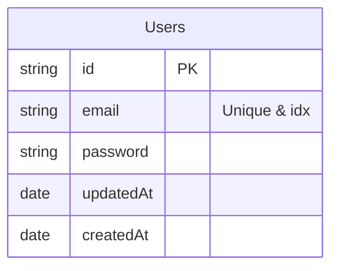
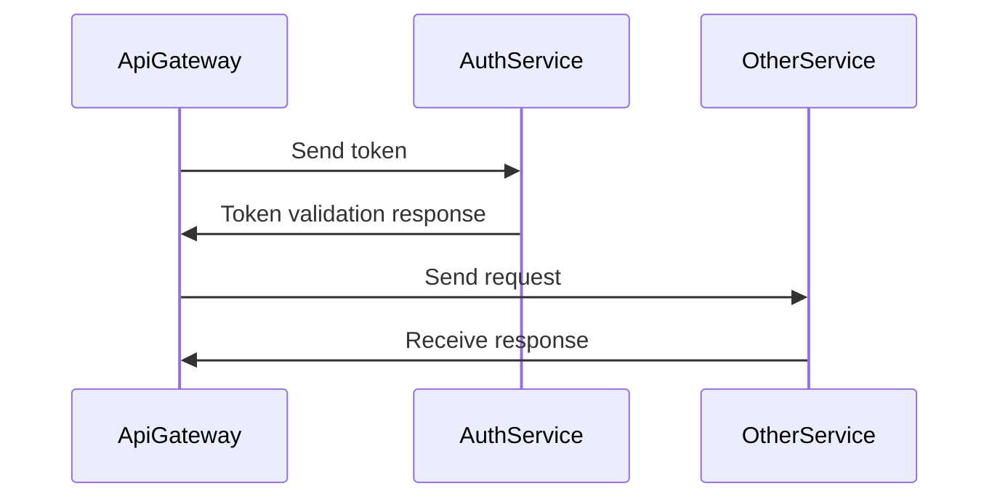
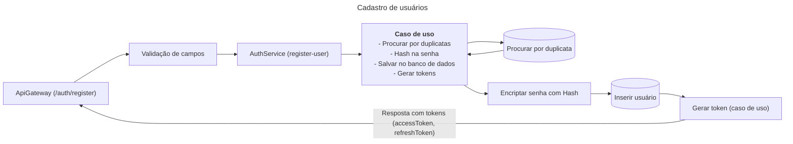

# Teste técnico JG

Construir um Sistema de Gestão de Tarefas Colaborativo com autenticação simples, CRUD de tarefas, comentários, atribuição e notificações. O sistema deve rodar em monorepo e expor uma UI limpa, responsiva e usável. O back‑end deve ser composto por microsserviços Nest que se comunicam via RabbitMQ; o acesso HTTP externo passa por um API Gateway (Nest HTTP).

## Apps

- [api-gateway](#api-gateway)
- [auth-service](#authservice)

## Pacotes

- [@microservices](#microservices)

## Progresso

Acompanhe como foi o progresso da criação de cada serviço.

- [x] AuthService
  - [x] Criar o domínio do serviço
    - Duração: **~2 horas**
    - [x] Setup inicial (nestjs & jest)
    - [x] Criar entidades
    - [x] Criar repositórios
    - [x] Criar os casos de uso
      - [x] Cadastro
      - [x] Login
      - [x] Gerar tokens
      - [x] Revalidar token
    - [ ] Testes unitários
  - [x] Integrar o domínio com a infraestrutura (NestJS Microservices, JWT, Bcrypt, DB typeORM)
    - Duração: **~1 hora + 1/2**
      - _+ uns 20 minutos configurando tudo do TypeORM 🥲_
    - [x] Criar repositórios/entidades utilizando TypeORM e Postgres
    - [x] Criar providers (Bcrypt, JWT)
    - [x] Criar controller
  - [ ] Testes de integração/e2e

## AuthService

Será o microsserviço responsável por lidar com toda a parte de autenticação dos usuários sendo elas: cadastro, login, validação e refresh de tokens.

#### Estrutura

#### Arquitetura

Como a autenticação deve ser integrada utilizando o ApiGateway e outros serviços:

#### Requisitos funcionais:

- [ ] Cadastro do usuário (email, username, password)
  - [ ] Hash de senha utilizando BCrypt
- [ ] Login do usuário (email, password)
- [ ] Geração de tokens JWT (accessToken, refreshToken)
- [ ] Revalidar token JWT (refreshToken)
- [ ] Validar token JWT (accessToken)
- [ ] Reset de senha (bônus)

#### Implementações

- Nesse serviço, decidi implementar DDD (Domain-Driven Design), algo que a longo prazo, é extremamente valioso quando pensamos em flexibilidade, escalabilidade e em manutenções futuras.
  - Trade-offs: A implementação em si pode ser um pouco mais trabalhosa.

## Diagramas

#### AuthService

