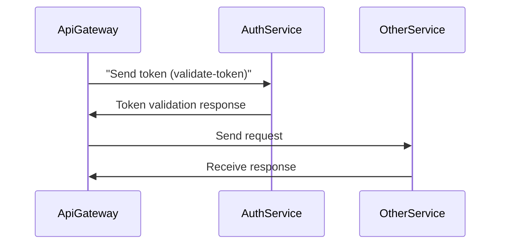
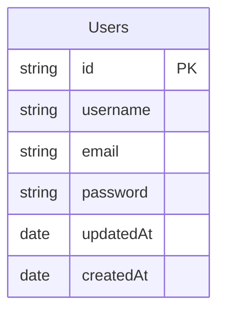
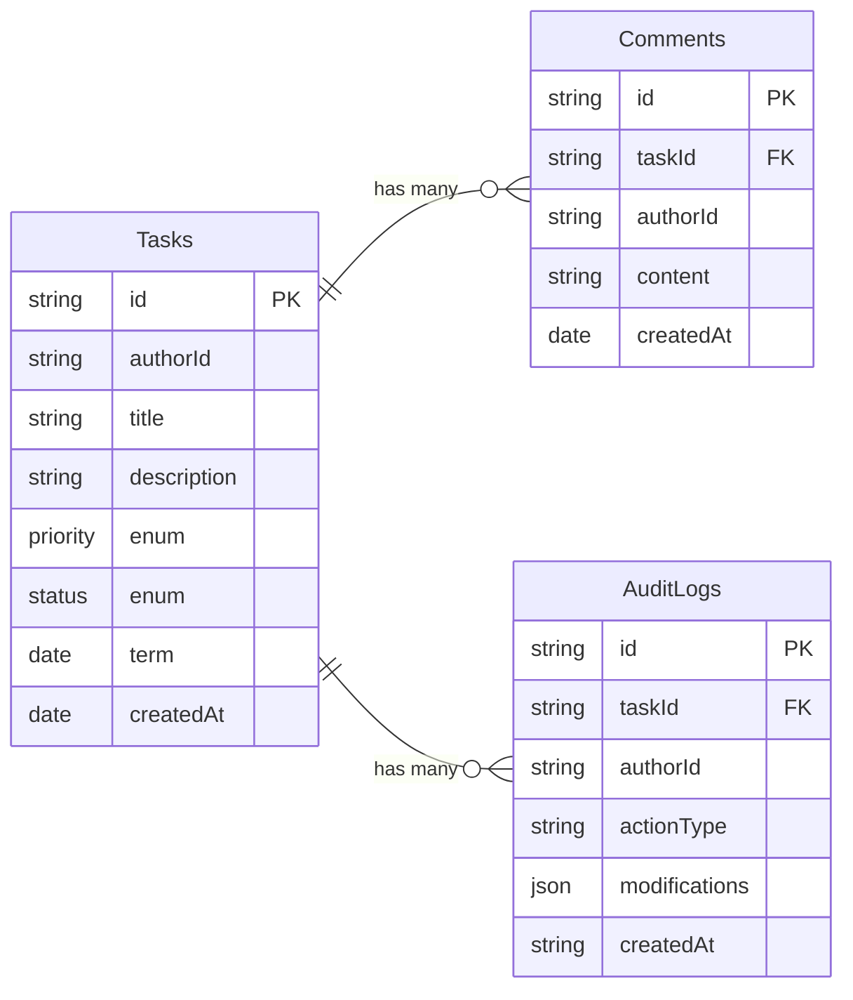

# Teste técnico JG

Construir um Sistema de Gestão de Tarefas Colaborativo com autenticação simples, CRUD de tarefas, comentários, atribuição e notificações. O sistema deve rodar em monorepo e expor uma UI limpa, responsiva e usável. O back‑end deve ser composto por microsserviços Nest que se comunicam via RabbitMQ; o acesso HTTP externo passa por um API Gateway (Nest HTTP).

## Apps

- [Api gateway](#apigateway)
- [Auth service](#authservice)
- [Tasks service](#authservice)

## Pacotes

- [@microservices](#microservices)

## Progresso

Acompanhe como foi o progresso da criação de cada serviço.

- [x] AuthService
  - [x] Criar o domínio do serviço
    - Duração: **~2 horas**
    - [x] Setup inicial (nestjs & jest)
    - [x] Criar entidades
    - [x] Criar repositórios
    - [x] Criar os casos de uso
      - [x] Cadastro
      - [x] Login
      - [x] Gerar tokens
      - [x] Revalidar token
    - [ ] Testes unitários
  - [x] Integrar o domínio com a infraestrutura (NestJS Microservices, JWT, Bcrypt, DB typeORM)
    - Duração: **~1 hora + 1/2**
      - _+ uns 20 minutos configurando tudo do TypeORM 🥲_
    - [x] Criar repositórios/entidades utilizando TypeORM e Postgres
    - [x] Criar providers (Bcrypt, JWT)
    - [x] Criar controller
  - [ ] Testes de integração/e2e
- [ ] ApiGateway
  - [x] Setup inicial
  - [x] Autenticação
    - Duração: **~30 minutos**
    - [x] AuthModule (controller & service & dto)
      - [x] Integração com [auth-service](#authservice)
    - [x] AuthGuards (controle de autenticação)
  - [ ] Tarefas
    - [ ] Criar serviço para realizar a integração com [task-service](#taskservice)
    - [ ] Criar dtos
    - [ ] Criar rotas

## ApiGateway

Serviço responsável por realizar o acesso HTTP aos demais serviços.

Requisitos:

- [ ] Autenticação com Guards
- [ ] Integrar todos os serviços com **RabbitMQ**
- [ ] DTOs (`class-validator` e `class-transformer`)
- [ ] Rate limit (10 req/seg)
- [ ] Documentação com Swagger
- [ ] Gateway WebSocket para notificações em tempo real
- [ ] Health checks
- [ ] Logging com Pino

## AuthService

Será o microsserviço responsável por lidar com toda a parte de autenticação dos usuários sendo elas: cadastro, login, validação e refresh de tokens.

#### Arquitetura

Como a autenticação deve ser integrada utilizando o ApiGateway e outros serviços:

#### Entidades

#### Requisitos funcionais:

- [x] Cadastro do usuário (email, username, password)
  - [x] Hash de senha utilizando BCrypt
- [x] Login do usuário (email, password)
- [x] Geração de tokens JWT (accessToken, refreshToken)
- [x] Revalidar token JWT (refreshToken)
- [x] Validar token JWT (accessToken)
- [ ] Reset de senha (bônus)

#### Implementações & Decisões

- Nesse serviço, decidi implementar DDD (Domain-Driven Design), algo que a longo prazo, é extremamente valioso quando pensamos em flexibilidade, escalabilidade e em manutenções futuras.
  - Trade-offs: A implementação em si pode ser um pouco mais trabalhosa.
- Realizar o gerenciamento de tokens apenas pelo JWT.
  - Benefícios: Uma implementação bem mais simples.
  - Trade-offs: Quando comparado com uma implementação mais complexa utilizando entidades para manter o controle dos tokens, você acaba perdendo informações/controles como: registro de localizações/data/ip, controle de acesso (revogar token), entre algumas outras coisas.
  - Motivação: Decidi ir pelo caminho mais simples até então; como é uma aplicação um tanto quanto "simples", não vi a necessidade de realizar essa implementação mais complexa.
  - _Caso sobre tempo acredito que seja um baita de um bônus._

## TaskService

Será o serviço responsável por lidar com toda a parte de tarefas, sendo elas: CRUD completo, comentários, audit log.

#### Entidades

> Prioridade: `LOW`, `MEDIUM`, `HIGH`, `URGENT`
> Status: `TODO`, `IN_PROGRESS`, `REVIEW`, `DONE`

#### Requisitos funcionais:

- [ ] Tarefas
  - [ ] Busca por múltiplas tarefas com paginação
  - [ ] Busca por uma tarefa especifica
  - [ ] Criação de novas tarefas
  - [ ] Atualizar tarefa
  - [ ] Excluir tarefa
- [ ] Histórico de alterações
  - [ ] Ao alterar uma tarefa deverá ser necessário o registro dessa alteração
- [ ] Comentários
  - [ ] Criar comentários associas a uma tarefa especifica
  - [ ] Listar comentários de uma tarefa em especifico

#### Implementações & Decisões

- ...
