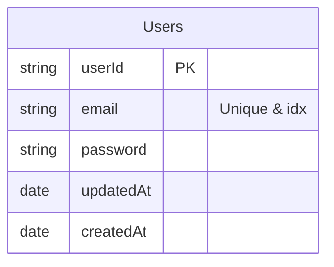
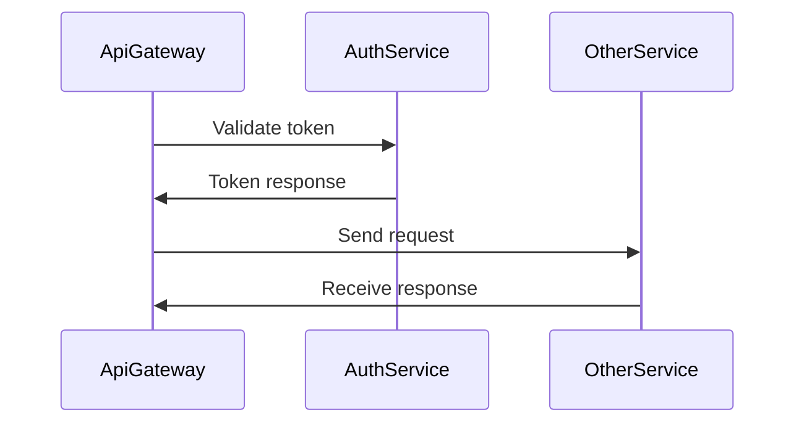

# Teste tecnico JG

Construir um Sistema de Gestão de Tarefas Colaborativo com autenticação simples, CRUD de tarefas, comentários, atribuição e notificações. O sistema deve rodar em monorepo e expor uma UI limpa, responsiva e usável. O back‑end deve ser composto por microserviços Nest que se comunicam via RabbitMQ; o acesso HTTP externo passa por um API Gateway (Nest HTTP).

## Apps

- [api-gateway](#api-gateway)
- [auth-service](#auth-service)

## Pacotes

- [@microservices](#microservices)

## Progresso

Acompanhe como foi o progresso da criação de cada serviço, todos eles estão em ordem do primeiro para o último.

- [ ] AuthService
  - [ ] Setup inicial
  - [ ] Criar entidades
  - [ ] Criar use-cases
    - [ ] Cadastro
    - [ ] Login
    - [ ] Gerar tokens
    - [ ] Revalidar token
    - [ ] Resetar senha
  - [ ] Integrar domain com a infra

## AuthService

Será o microserviço reponsável por lidar com toda a parte de autenticação dos usuários sendo elas: cadastro, login, validação e refresh de tokens.

#### Estrutura

#### Arquitetura

Como a autenticação deve ser integrada utilizando o ApiGateway e outros serviços:

#### Requisitos funcionais:

- [ ] Cadastro do usuário (email, username, password)
- [ ] Hash de senha utilizando BCrypt
- [ ] Login do usuário (email, password)
- [ ] Geração de tokens JWT (accessToken, refreshToken)
- [ ] Revalidar token JWT (refreshToken)
- [ ] Validar token JWT (acessToken)
- [ ] Reset de senha (bônus)

#### Implementações

- Nesse serviço, decidi implementar DDD (Domain-Driven Design), algo que a longo prazo, é extremamente valioso quando pensamos em flexibilidade, escalabilidade e em manutenções futuras.
  - Trade-offs: A implementação em si pode ser um pouco mais trabalhosa.

## Diagramas

#### AuthService

